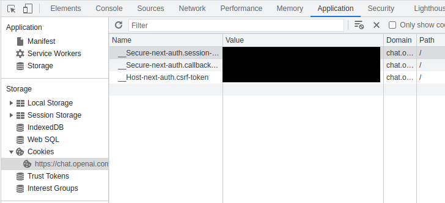
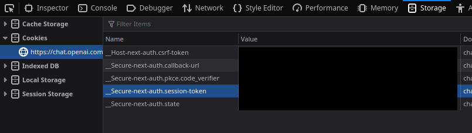

# ChatGPT-rs

This is a reverse-engineered wrapper for the OpenAI's ChatGPT model.

## Usage

```rust
use chatgpt::prelude::*;

#[tokio::main]
async fn main() -> chatgpt::Result<()> {
    // Starting client
    let token: String = // obtain the session token. More on session tokens later.
    let mut client = ChatGPT::new(token)?;
    client.refresh_token().await?; // it is recommended to refresh token after creating a client
    
    // sending a simple message
    // normal responses take ~10-30 seconds to complete
    let response: String = client.send_message("Write me an HTTP server in Rust using the Axum framework.").await?;

    // in case dynamic updates are important
    // this method allows to receive the message as a stream
    let stream = client.send_message_streaming(None, None, "Write me an HTTP server in Rust using the Axum framework.").await?;
    
    while let Some(part) = stream.next().await {
        // a single response part
        println!("Got response part: {part:?}");
    }
}
```

## Session Tokens
Session tokens allow access to the OpenAI API. You can find them in the Cookie storage of your browser.

### Chromium-based browsers

Do this on the [ChatGPT website](https://chat.openai.com/chat)
1. Ctrl+Shift+I to open dev tools
2. Navigate to the Application tab
3. On the left, choose Storage->Cookies->https://chat.openai.com/chat
4. Get the value of the cookie with name `__Secure-next-auth.session-token`



### Firefox-based browsers

Do this on the [ChatGPT website](https://chat.openai.com/chat)
1. Ctrl+Shift+I to open dev tools
2. Navigate to the Storage tab
3. On the left choose Cookies->https://chat.openai.com/chat
4. Get the value of the cookie with name `__Secure-next-auth.session-token`



## Library roadmap

- [x] Refreshing tokens
- [x] Sending message and receiving response
- [x] Receiving response as a stream
- [ ] Scoped conversations
- [ ] Multiple conversations at the same time